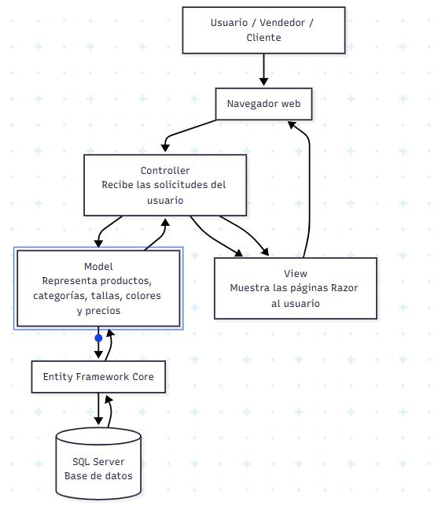

# ADR-03: Estilo arquitectónico de CatalogoAPP

| Campo  | Valor          |
| ------ | -------------- |
| Autor  | Marcelo Medina |
| Fecha  | 12/06/2026     |
| Estado | Aceptado       |

---

## Contexto

CatalogoAPP es una aplicación web para pequeños vendedores y revendedores de ropa. El sistema busca permitir la administración y visualización de productos como prendas, categorías, tallas, colores, precios e imágenes, evitando que el vendedor dependa únicamente de redes sociales, notas o archivos separados para mostrar su catálogo.

En decisiones anteriores se aceptó usar C#, ASP.NET Core MVC, Entity Framework Core, SQL Server y GitHub como base tecnológica del proyecto. Además, en el ADR-02 se documentaron las vistas arquitectónicas iniciales del sistema: vista lógica, vista física, vista de despliegue y vista de procesos.

La decisión actual consiste en definir el estilo arquitectónico principal que guiará la construcción de CatalogoAPP. Esta decisión debe ayudar a mantener el sistema organizado, entendible y fácil de defender en clase, considerando que el proyecto se desarrollará durante el cuatrimestre y que todavía no requiere una infraestructura distribuida compleja.

---

## Decisión

Se decidió utilizar un estilo arquitectónico **cliente-servidor con arquitectura en capas basada en MVC**.

El sistema funcionará como una aplicación web donde el usuario accede desde un navegador y realiza acciones como consultar productos o administrar el catálogo. Del lado del servidor, ASP.NET Core MVC se encargará de recibir las peticiones, procesarlas y devolver las vistas correspondientes.

La aplicación se organizará por responsabilidades en capas principales:

* **Capa de presentación:** contiene las vistas Razor, archivos CSS, imágenes y elementos visuales del catálogo.
* **Capa de control:** contiene los controladores, que reciben las solicitudes del navegador y coordinan la respuesta.
* **Capa de dominio o aplicación:** contiene los modelos principales del sistema, como productos, categorías, tallas, colores y precios.
* **Capa de acceso a datos:** utiliza Entity Framework Core para comunicarse con SQL Server y guardar la información del catálogo.

### ¿Por qué?

Este estilo resuelve mejor el problema de CatalogoAPP porque el sistema necesita ser una aplicación web sencilla de usar, centralizada y mantenible. El vendedor puede administrar sus productos desde el navegador y los clientes pueden consultar el catálogo sin instalar una aplicación adicional.

La arquitectura cliente-servidor permite separar claramente el navegador del usuario y la aplicación que se ejecuta en el servidor. Esto facilita que el sistema pueda ser consultado desde distintos dispositivos mientras los datos permanecen centralizados.

La organización en capas basada en MVC ayuda a separar responsabilidades. Las vistas se enfocan en mostrar la información, los controladores manejan las solicitudes, los modelos representan los datos del catálogo y la capa de acceso a datos se encarga de la persistencia.

Esta separación hace que sea más fácil agregar funcionalidades como filtros por categoría, carga de imágenes, gestión de inventario o edición de productos sin mezclar toda la lógica en un solo lugar.

También es una decisión adecuada para el alcance actual del proyecto, ya que permite construir una primera versión funcional sin agregar complejidad innecesaria como microservicios, eventos distribuidos o funciones serverless.

---

### Alternativas consideradas

| Alternativa        | Por qué la descarté                                                                                                                                                                                                                           |
| ------------------ | --------------------------------------------------------------------------------------------------------------------------------------------------------------------------------------------------------------------------------------------- |
| Microservicios     | Se descartó porque CatalogoAPP todavía es un proyecto pequeño. Dividirlo en varios servicios aumentaría la complejidad de despliegue, comunicación, pruebas y mantenimiento sin una necesidad real en esta etapa.                             |
| Event-driven       | Se descartó porque el flujo principal del sistema es directo: el vendedor administra productos y el cliente consulta el catálogo. No se requiere una arquitectura basada en eventos, colas o comunicación asíncrona para la versión inicial.  |
| Serverless         | Se descartó porque el proyecto necesita una estructura web clara con controladores, vistas y base de datos. Además, serverless agregaría dependencia de servicios externos y complicaría la explicación del sistema para el alcance de clase. |
| Hexagonal          | Se descartó para esta versión porque, aunque mejora el aislamiento del dominio, puede agregar más interfaces, adaptadores y estructura de la necesaria. Para el alcance actual, MVC en capas es más simple de implementar y defender.         |
| Monolito sin capas | Se descartó porque mezclar vistas, lógica y acceso a datos en una sola estructura haría más difícil mantener el sistema, agregar funciones y explicar la arquitectura.                                                                        |

---

## Consecuencias

**✅ Lo que gano:**

* **Consecuencia técnica:** el sistema queda organizado por responsabilidades, lo que facilita modificar una parte sin afectar directamente a las demás. Por ejemplo, se puede cambiar una vista sin modificar la lógica de acceso a datos.
* **Consecuencia de mantenimiento:** será más fácil agregar nuevas funcionalidades como búsqueda de productos, filtros por talla o color, carga de imágenes y administración de inventario.
* **Consecuencia sobre el proceso:** el equipo o el desarrollador puede trabajar siguiendo una estructura clara, ubicando cada archivo en la capa correspondiente.
* **Consecuencia para la exposición:** el estilo cliente-servidor con MVC en capas es fácil de explicar mediante las vistas lógica, física, de despliegue y de procesos documentadas previamente.

**⚠️ Lo que sacrifico o asumo:**

* **Limitación técnica:** al ser una aplicación centralizada, si el servidor falla, los usuarios no podrían acceder al catálogo hasta que el servicio vuelva a estar disponible.
* **Deuda o riesgo:** si el proyecto crece demasiado, podría ser necesario separar mejor la lógica de negocio o migrar algunas partes a una arquitectura más avanzada, como hexagonal o microservicios.
* **Mayor disciplina de desarrollo:** aunque se use MVC, existe el riesgo de colocar demasiada lógica en los controladores si no se mantiene una separación clara de responsabilidades.
* **Escalabilidad limitada al inicio:** esta arquitectura es suficiente para una primera versión, pero si muchos vendedores usan el sistema al mismo tiempo, se tendría que revisar el despliegue, la base de datos y el rendimiento.

---

## Diagrama

El siguiente diagrama Mermaid muestra cómo se aplica el estilo cliente-servidor con arquitectura en capas basada en MVC dentro de CatalogoAPP.

---

## Conclusión

La decisión de utilizar un estilo cliente-servidor con arquitectura en capas basada en MVC permite que CatalogoAPP tenga una estructura clara, funcional y adecuada para su alcance actual. Este estilo ayuda a separar la interfaz, el control de solicitudes, la lógica del catálogo y el acceso a datos, lo que facilita el desarrollo, mantenimiento y explicación del proyecto.

Además, esta decisión se alinea con las vistas arquitectónicas documentadas en el ADR-02, ya que permite representar el sistema desde la vista lógica, física, de despliegue y de procesos de una manera coherente.

---

## Cláusula de uso de inteligencia artificial

Para la elaboración de este documento se utilizó inteligencia artificial como herramienta de apoyo en la organización de ideas, redacción y mejora de la estructura del contenido.

